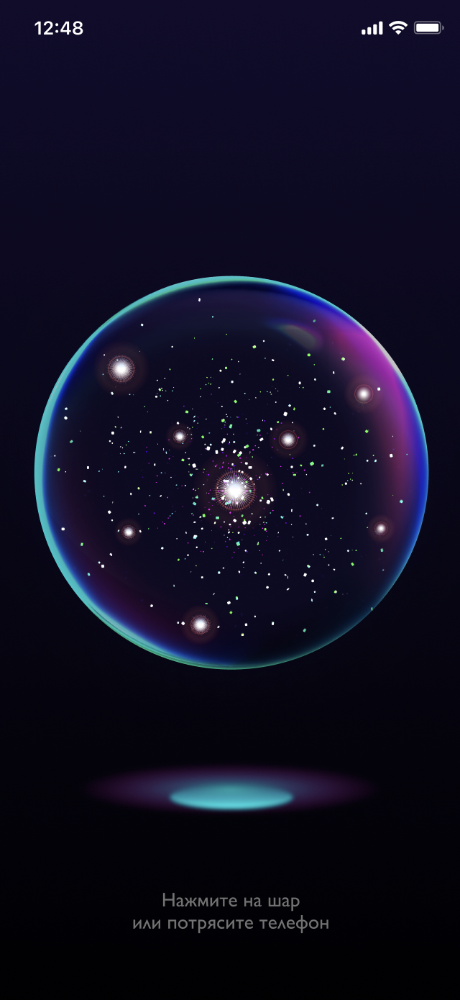
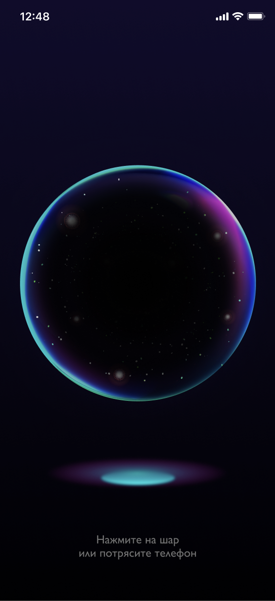
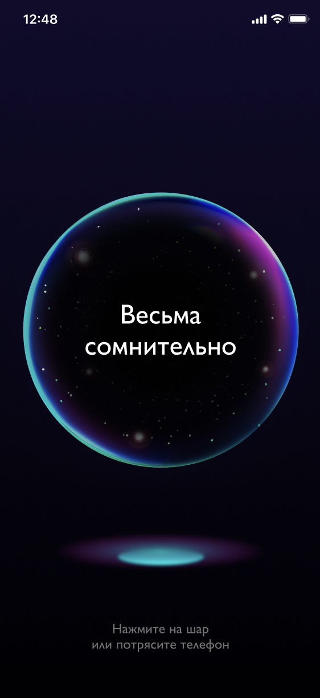

# Surf Flutter Study Jam 4

<p align="center">

</p>

## Требования к приложению

- Версия Flutter: **3.10.3**
- Версия Dart: **3.0.3**

Ваша ветка с выполнением задания называется `study-jam-4`.

В шаблонном приложении у вас уже есть начальный экран.

В процессе реализации вы можете опираться на [этот дизайн](https://www.figma.com/file/8eGQl9M0NzIkCDszJpbKk1/Magic-ball?type=design&node-id=12-32196&mode=design&t=EUnH2x1B5XyiVSI2-0).

Эмоджи 🔥 показывает задание повышеной сложности.

---

### Описание фичи

> Данное задание взято из новых [Flutter-курсов Surf](https://education.surf.ru/).

```
Вы, начинающий и наивный фрилансер в поисках своего первого заказа, получаете сообщение на свою почту:

От: Кармелита Честная 
Кому: [Ваше имя]

Тема: Заказ на разработку приложения "Магический Шар"

Здравствуйте,

Моё имя Кармелита Честная и я ищу опытного разработчика для создания мобильного приложения, имитирующего магический шар.

Я верю, что такое приложение может принести много счастья и радости в жизни людей. И я готова поделиться своими богатствами и обещаю удачу в личной жизни тому, кто поможет мне воплотить эту идею в жизнь.

Согласно моим требованиям, приложение должно состоять из одного экрана, на котором будет изображён магический шар. Пользователь мысленно задаёт вопрос, после чего нажимает на шар (или трясёт телефоном), и приложение выдаёт ответ.

С нетерпением жду вашего ответа и возможности начать работу над этим проектом.

С уважением, 
Кармелита Честная
```
## Техническое задание

### Источник данных

Вам предстоит отправить запрос на сервер для того, чтобы узнать, что готовит судьба.

Документация API для ознакомления: https://www.eightballapi.com/docs

Базовый URL для отправки запросов: `https://eightballapi.com/api`

Пример ответа по GET-запросу: `{"reading":"My reply is no."}`

### Флоу работы шара

#### Начальное состояние 

Шар активен, но не имеет текста внутри. 

<p align="center"></p>

#### Алгоритм

##### Сценарий 1

1. Пользователь нажимает на шар / пользователь трясет телефоном.
2. Шар начинает затемняется изнутри. Текст предыдущего ответа (если он был) исчезает.
   
   <p align="center"></p>
3. Отправляется запрос на получение ответа шара.
4. Запрос выполнен...
    - успешно — в шаре текст полученного ответа, затемнение исчезает;

       <p align="center"></p>

    - неудачно — шар заполняется красным светом.
       
       <p align="center"></p>


##### Сценарий 2

Предусловия: идёт загрузка ответа шара.

1. Пользователь нажимает на шар / пользователь трясет телефоном.
2. Ничего не происходит.

 
## Итак, давайте начнём!

> Небольшие рекомендации: 
> 
> - Не забывайте писать комментарии к классам и методам чтобы другим разработчикам было сразу понятно, что тут происходит. 
> Умение писать понятный код это важный навык для командной разработки.
> - Помните про форматирование кода 👆.

### Задание 1

Реализуйте интерфейс экрана с магическим шаром.

### Задание 2

Реализуйте бизнес-логику нажатия на шар для получения ответа. Используйте мок-данные для отображения.

### Задание 3

Добавьте логику для обработки пользовательского вопроса и получения ответа от API.

При нажатии на шар отправьте GET-запрос к API и получите ответ.
Обработайте успешный ответ от API и отобразите его внутри магического шара.
Обработайте ошибочный ответ от API и отобразите сообщение об ошибке внутри магического шара.

### Задание 4

Реализуйте отправку запроса при тряске телефона.

> Для отслеживания тряски можно использовать пакет [shake](https://pub.dev/packages/shake).


### Задание 5

Адаптируйте приложения для запуска на десктоп/веб-платформах, а также планшетах. 

### Задание 6 🔥

Добавьте анимацию движения шара:
- при обычном состоянии шар должен плавно парить вверх-вниз
- шар отбрасывает цветную тень
- при выполнении запроса шар сотрясается и пульсирует светом (или затемняется) внутри

### Задание 7 🔥

Добавьте в приложение экран настроек, где вы сможете:
- менять цвет шара 
- менять скорость и кривую анимации шара в спокойном положении 
- настраивать анимацию шара при тряске 


### Задание 8 🔥

При выдаче ответа/ошибки можете добавить аудио-эффект для шара. 

Если у вас реализован экран настроек - добавьте возможность настройки звука оттуда. 🔥

Также можете добавить возможность выбора звука с устройства. 🔥🔥


### Задание 9 🔥

Добавьте воспроизведение ответа с помощью голосового помощника! 

Если у вас есть экран настроек - вынесите возможность включения/отключения этой функции туда. 

### Задание 10 🔥🔥

Анимируйте появление текста внутри шара - например, его плавное проявление из размытия и прозрачности или имитация его печати. 

Если у вас реализован экран настроек - добавьте возможность настройки анимации текста туда. 🔥

### Задание 11 🔥🔥🔥

Добавьте в ваш шар звёзды и оживите их с помощью параллакс-эффекта!

### Задание 12 🔥🔥🔥🔥

Есть интересная идея, как добавить в ваш шар ещё больше магии? Дерзайте!


## Что стоит знать при выполнении заданий

- Вашей целью не является выполнение **всех** заданий. Выбирайте для выполнения то, что вам по силам и интереснее реализовывать лично для вас.
- Предоставленный дизайн является только референсом - вам необязательно повторять его в точности. Фантазируйте и делайте так, как вам подсказывает ваше чувство прекрасного 🥰
- За использованией фичей [Dart 3](https://habr.com/ru/companies/surfstudio/articles/733532/) полагаются дополнительные баллы 🤑.

# Предоставление результатов

Умение защитить результаты своей работы - невероятно важный навык для разработчика.

В текущем проекте есть файл `/docs/RESULT.md`. Этот шаблон нужен как раз для того, чтобы вы могли поделиться результатами вашей работы. Вы можете записать скринкаст, сделать скриншоты или целый README-файл, в котором будет описано, что вы успели сделать.

Это один из критериев, по которому будет оцениваться ваша работа!